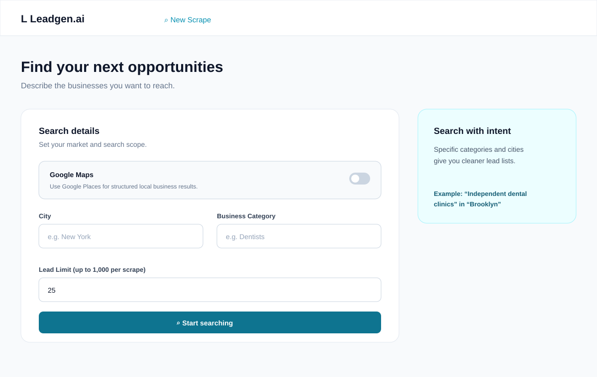
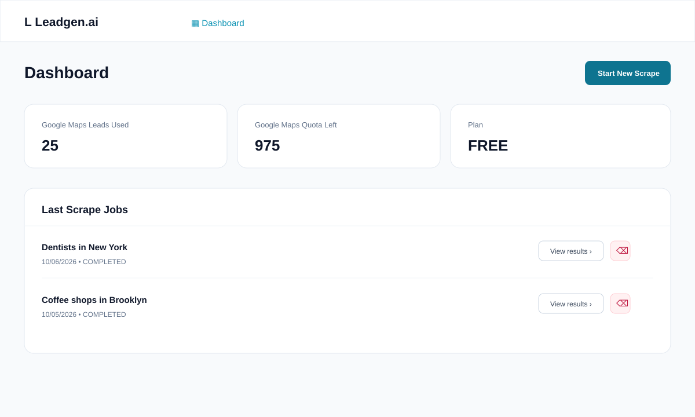

# OfflineBizFinder

OfflineBizFinder helps you find local businesses, review their contact details, and export leads for outreach. You can search with Google Maps or use the Crawlee public-web scraper.

## Start here

The quickest way to run the complete app is Docker.

### Option A: one container

```bash
docker run -d --name leadgen \
  --restart unless-stopped \
  -p 80:80 \
  -v leadgen-data:/var/lib/postgresql/data \
  -e JWT_SECRET='replace-with-a-long-random-secret' \
  ghcr.io/pranay202/leadgen.ai:latest
```

Open [http://localhost/](http://localhost/) (or `http://SERVER_IP/` on a remote server).

Google Maps searches also need an API key:

```bash
-e GOOGLE_MAPS_API_KEY='your-google-maps-key'
```

Crawlee searches do not need that key.

### Option B: run the services locally

You need Node.js 20+, Docker, and npm.

```bash
docker compose up -d db

cd app/api
npm install
npx prisma generate
npx prisma migrate dev
npm run dev
```

In another terminal:

```bash
cd app/web
npm install
npm run dev
```

Then open [http://localhost:3000/](http://localhost:3000/). The API runs on port `3001` and PostgreSQL runs on port `5432`.

For local API configuration, set `DATABASE_URL`, `JWT_SECRET`, and, when using Google Maps, `GOOGLE_MAPS_API_KEY`. The Docker Compose defaults are already in `docker-compose.yml`.

## Your first search

1. Create an account with an email and a password of at least six characters.
2. From the dashboard, choose **New Scrape**.
3. Choose a scraper. Google Maps is structured and quota-based; Crawlee visits public business websites and does not use the Google Maps quota.
4. Enter a city, a business category, and the number of leads you want.
5. Choose **Start searching**. The results page updates while the job is running.
6. When the job is complete, use **Export CSV** to download the list.



Example: search for `Dentists` in `New York` with a limit of `25`.

## Understanding the dashboard

The dashboard shows your Google Maps usage, remaining quota, plan, and recent jobs. Open a completed job to review its business name, phone, email, owner, company size, revenue, website, domain age, and lead score.



Completed jobs can now be removed from either the dashboard or the results page. Deletion also removes the businesses stored under that job and cannot be undone. Jobs that are still pending or processing are intentionally not deletable.

## Scraper choices and limits

| Scraper | Best for | API key | Counts toward Google Maps quota |
| --- | --- | --- | --- |
| Google Maps | Structured local business results | Required | Yes |
| Crawlee | Public-web discovery without a Maps key | Not required | No |

Each scrape accepts between 1 and 1,000 leads. A new account starts with a 1,000-lead Google Maps allowance. The allowance is tracked separately from Crawlee usage.

## Useful commands

```bash
# API
cd app/api
npm run build
npm start

# Web
cd app/web
npm run lint
npm run build
npm start

# Stop local database
docker compose down
```

The API health check is available at [http://localhost:3001/health](http://localhost:3001/health).

## API overview

All `/api/jobs` routes require a bearer token from login or signup.

| Method | Route | Purpose |
| --- | --- | --- |
| `POST` | `/api/auth/register` | Create an account |
| `POST` | `/api/auth/login` | Sign in and receive a token |
| `GET` | `/api/auth/me` | Read the current account |
| `POST` | `/api/jobs` | Start a scrape |
| `GET` | `/api/jobs` | List the signed-in user’s recent jobs |
| `GET` | `/api/jobs/:id` | Read paginated job results |
| `GET` | `/api/jobs/:id/export` | Download a completed job as CSV |
| `DELETE` | `/api/jobs/:id` | Delete that user’s completed job |

## Project layout

```text
app/
├── api/                 Express API, Prisma schema, migrations, scrapers
└── web/                 Next.js pages and UI components
docker/                  Dockerfiles, Nginx, startup scripts
docker-compose.yml       Local PostgreSQL + API + web services
docs/screenshots/        README product screenshots
```

## Data and deployment notes

- PostgreSQL data is kept in the `leadgen-data` Docker volume for the single-container deployment or `postgres_data` for Compose.
- Set a long, unique `JWT_SECRET` before exposing the app to other users.
- Google Maps credentials are optional only when using Crawlee.
- Do not commit secrets or `.env` files.

## License

See [LICENSE](LICENSE).
